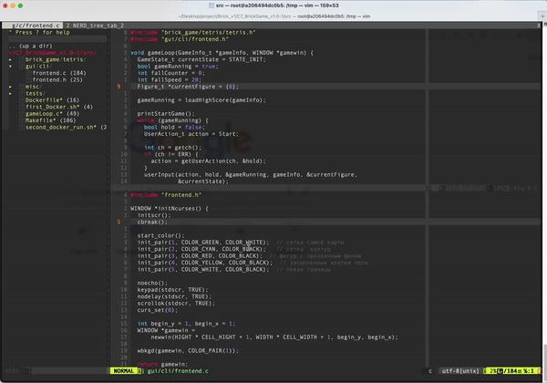

# Vim Configuration

Этот репозиторий содержит мою личную конфигурацию Vim, которую я использую для более удобной работы с кодом и текстом.



## Описание

В этом файле `.vimrc` настроены следующие опции и плагины:

### Основные настройки

- **Отображение номеров строк:**
  - `set number` — отображение номера строки.
  - `set relativenumber` — отображение относительного номера строки от курсора.
  - `set number relativenumber` — комбинированный режим.

- **Буфер обмена:**
  - `set clipboard=unnamed` и `set clipboard+=unnamedplus` — использование системного буфера обмена.

- **Отступы и табуляция:**
  - `set tabstop=4` — количество пробелов, которые заменяют табуляцию.
  - `set shiftwidth=4` — количество пробелов для отступов.
  - `set smarttab` — умная табуляция.

- **Подсветка и поиск:**
  - `set showmatch` — подсветка скобок.
  - `set hlsearch` — подсветка результатов поиска.
  - `set incsearch` — инкрементальный поиск.
  - `set ignorecase` — игнорирование регистра в поиске.

- **Автоотступы и форматирование:**
  - `set ai` — автоматические отступы.
  - `autocmd filetype cpp set cin` — отступы для C++.
  - `autocmd filetype c set cindent` — отступы для C.

- **Отображение и прокрутка:**
  - `set scrolloff=7` — минимальное количество строк, отображаемых при прокрутке.
  - `set wrap linebreak nolist` — перенос строк по словам, а не по символам.

### Плагины

Используется [vim-plug](https://github.com/junegunn/vim-plug) для управления плагинами:

- **Внешний вид:**
  - `Plug 'ErichDonGubler/vim-sublime-monokai'` — цветовая схема SublimeText.
  - `Plug 'vim-airline/vim-airline'` — статус-бар.

- **Функциональность:**
  - `Plug 'scrooloose/nerdtree', { 'on': 'NERDTreeToggle' }` — файловый проводник.
  - `Plug 'ryanoasis/vim-devicons'` — иконки файлов.
  - `Plug 'viis/vim-bclose'` — управление буферами.
  - `Plug 'tpope/vim-surround'` — управление окружением пар.

### Маппинги и команды

- **Горячие клавиши:**
  - `CTRL+n` — включение/выключение NERDTree.
  - `F2` — включение номеров строк.
  - `F3` — отключение номеров строк.
  - `,<space>` — отключение подсветки поиска.
  - `jk` — имитация ESC в режиме вставки.

- **Автокомпиляция и запуск:**
  - Автоматический запуск Python, C, Go и Shell скриптов с помощью `CTRL+h`.

## Установка

1. Клонируйте репозиторий:

   ```sh
   git clone https://github.com/RimTanaka/Vim
   ```

2. Скопируйте содержимое .vimrc в свой домашний каталог:

   ```sh
   cp путь_к_вашему_репозиторию/.vimrc ~/.vimrc
   ```

4. Установите плагины, запустив Vim и выполнив команду `:PlugInstall`.
